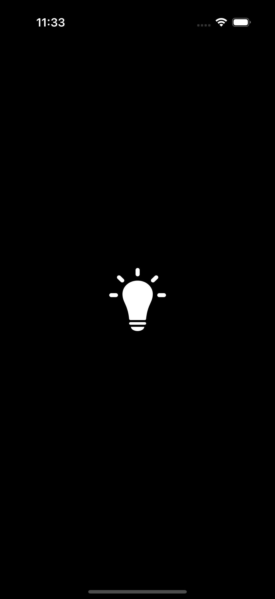
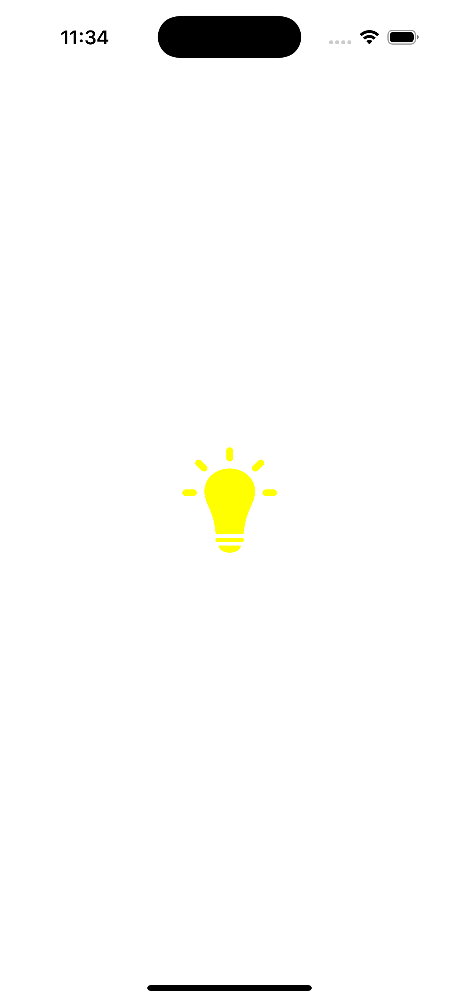

# 💡 Simple Lamp App

**Simple Lamp App** is a basic iOS application that simulates turning a lamp on and off. When the lamp button is pressed, the background color toggles between black (off) and white (on), mimicking a flashlight effect.

This app was built using **UIKit with Storyboards**, making it ideal as a beginner project to learn interface building and simple state toggling in iOS.

---

## 📱 Features

- 🕹 Tap to toggle background color
- 💡 Simulates a basic on/off lamp
- 🧰 Built using **Storyboards**

---

## 🧰 Technologies

- **Swift**
- **UIKit**
- **Storyboards**

---

## 🖼 Preview

<p align="center">
  
  
</p>

> *Example of the app when the lamp is ON/OFF.*

---

## 🚀 Getting Started

1. Clone the repository:
   ```bash
   git clone https://github.com/yisslu/Lamp.git
2. Open the project in XCode:
   ```bash
   open lamp.xcodeproj
3. Build and run on simulator or real device.
